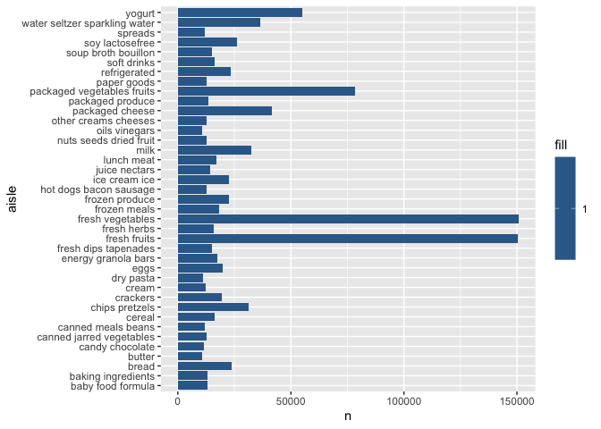
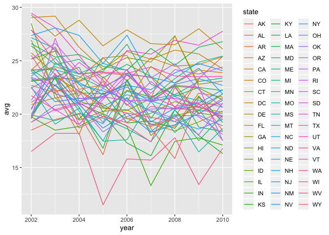
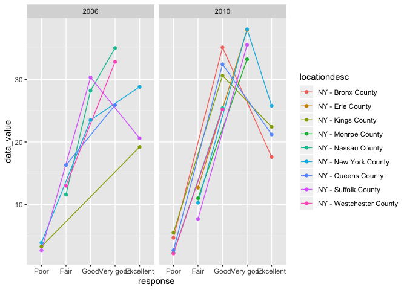
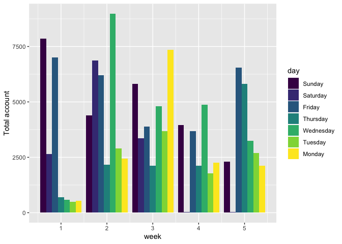
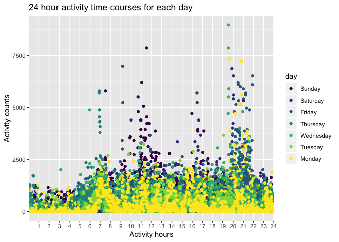
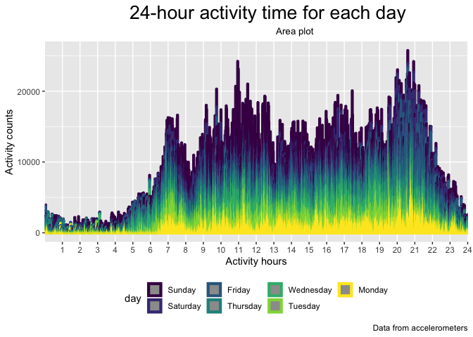

p8105\_hw3\_yj2579
================
Yingxi Ji
10/7/2019

# Problem 1

``` r
# Load the data
library(p8105.datasets)
data("instacart")
data("brfss_smart2010")
```

The instacart dataset contains 1384617 observations and 15 variables.
This is a (1384617, 15) dataframe, containing data related to orders
from the instacart website. There are both numeric variables such as ID
and orer number, character variables such as product names, and logical
variable.

The key variables are `order_id` (id of the order), `product_id`( each
item in each order), `user_id`(the user), `aisle_id` and `aisle` (the
aisle for different products).

## Part 1

The ‘aisle’ is ranged from 0-135, so there are 135 different aisles. And
aisle 83 is odered the most. (id=83,number=150609)

``` r
# Find the max and show a table of top 5 
aisle_fre = 
  instacart  %>%
  group_by(aisle_id) %>% 
  summarize(n = n()) %>% 
  arrange(desc(n))

aisle_fre[1:5,] %>%
  knitr::kable(align = 'c')
```

| aisle\_id |   n    |
| :-------: | :----: |
|    83     | 150609 |
|    24     | 150473 |
|    123    | 78493  |
|    120    | 55240  |
|    21     | 41699  |

``` r
# Find the max by counting number of each aisle group
aisle_fre[which.max(aisle_fre$n),1]
```

    ## # A tibble: 1 x 1
    ##   aisle_id
    ##      <int>
    ## 1       83

## Part 2

``` r
# Showing the aisle with more the 10000 orders. 
aisle_more = 
  instacart %>% 
  group_by(aisle) %>% 
  count() %>% 
  filter(n>10000)

# Make a readable plot 
ggplot(aisle_more,aes(x=aisle, y=n, fill = 1))+
  geom_bar(stat = "identity")+coord_flip()
```

<!-- -->

``` r
  theme(axis.text.x = element_text(angle = 60, hjust = 1))
```

    ## List of 1
    ##  $ axis.text.x:List of 11
    ##   ..$ family       : NULL
    ##   ..$ face         : NULL
    ##   ..$ colour       : NULL
    ##   ..$ size         : NULL
    ##   ..$ hjust        : num 1
    ##   ..$ vjust        : NULL
    ##   ..$ angle        : num 60
    ##   ..$ lineheight   : NULL
    ##   ..$ margin       : NULL
    ##   ..$ debug        : NULL
    ##   ..$ inherit.blank: logi FALSE
    ##   ..- attr(*, "class")= chr [1:2] "element_text" "element"
    ##  - attr(*, "class")= chr [1:2] "theme" "gg"
    ##  - attr(*, "complete")= logi FALSE
    ##  - attr(*, "validate")= logi TRUE

There are 39 aisles with more than 10000 items ordered. Plot of the
ranking showing
above.

## Part 3

``` r
# if doing the following, I got three subset and combine them altogether to make a table, but redundent. 

# packed_vege = instacart %>% 
#   filter(aisle=="packaged vegetables fruits") %>% 
#   group_by(product_name) %>% 
#   count() %>% 
#   arrange(desc(n))%>% 
#   head(3)
# 
# baking = instacart %>% 
#   filter(aisle=="baking ingredients") %>% 
#   group_by(product_name) %>% 
#   count() %>% 
#   arrange(desc(n))%>% 
#   head(3)
# 
# dog_food = instacart %>% 
#   filter(aisle=="dog food care") %>% 
#   group_by(product_name) %>% 
#   count() %>% 
#   arrange(desc(n))%>% 
#   head(3)
# 
# total = rbind(dog_food, baking, packed_vege)

# Then I doing all the three subset in one set by filtering the three. 

  instacart %>%
  filter(aisle %in% c('baking ingredients', 'dog food care', 'packaged vegetables fruits')) %>% 
  group_by(aisle, product_name) %>% 
  summarise(nitem = n()) %>% 
  arrange(desc(nitem)) %>% 
  top_n(1:3, nitem) %>% 
  knitr::kable(align = 'c')
```

    ## Warning in if (n > 0) {: the condition has length > 1 and only the first
    ## element will be used

    ## Warning in min_rank(desc(wt)) <= n: longer object length is not a multiple
    ## of shorter object length

    ## Warning in if (n > 0) {: the condition has length > 1 and only the first
    ## element will be used

    ## Warning in min_rank(desc(wt)) <= n: longer object length is not a multiple
    ## of shorter object length

    ## Warning in if (n > 0) {: the condition has length > 1 and only the first
    ## element will be used

    ## Warning in min_rank(desc(wt)) <= n: longer object length is not a multiple
    ## of shorter object length

|           aisle            |                 product\_name                 | nitem |
| :------------------------: | :-------------------------------------------: | :---: |
| packaged vegetables fruits |             Organic Baby Spinach              | 9784  |
| packaged vegetables fruits |              Organic Raspberries              | 5546  |
| packaged vegetables fruits |              Organic Blueberries              | 4966  |
|     baking ingredients     |               Light Brown Sugar               |  499  |
|     baking ingredients     |               Pure Baking Soda                |  387  |
|     baking ingredients     |                  Cane Sugar                   |  336  |
|       dog food care        | Snack Sticks Chicken & Rice Recipe Dog Treats |  30   |
|       dog food care        |      Organix Chicken & Brown Rice Recipe      |  28   |
|       dog food care        |              Small Dog Biscuits               |  26   |

There are most orderds from ‘packaged vegetables fruits’ and the other
two have less orders.

## Part 4

``` r
# Make two subset and find the mean
apple = instacart %>%
  filter(product_name %like% "Pink Lady Apples") %>% 
  group_by(order_dow) %>% 
  summarise(mean_hour = mean(order_hour_of_day)) %>% 
  mutate(product = "Pink Lady Apples") 
   
ice_cream = instacart %>%
  filter(product_name %like% "Coffee Ice Cream") %>% 
  group_by(order_dow) %>% 
  summarise(mean_hour = mean(order_hour_of_day)) %>% 
  mutate(product = "Coffee Ice Cream")
  

# combine the mean
mean_hour_two_product = rbind(apple, ice_cream)
# make a table 
mean_hour_table = 
  pivot_wider(
  mean_hour_two_product,
  id_cols = "product",
  names_from = "order_dow",
  values_from = "mean_hour"
) %>% 
  rename("Sun" = '0', 
         "Mon" = '1', 
         "Tue" = '2', 
         "Wed" = '3', 
         "Thu" = '4', 
         "Fri" = '5', 
         "Sat" = '6') %>% 
  knitr::kable(align = 'c', digits = 2)
```

They are placed around 11:00 and 15:00 every day. Sales should increase
the advertising frequency of these two products on the website at this
time.

# Problem 2

## Part 1

``` r
# Take out of the main data that we focused. 
# Then define levels.
over_health = 
brfss_smart2010 %>% 
  janitor::clean_names() %>% 
  filter(topic == "Overall Health") %>% 
  mutate(response = factor(response, order = "TRUE", 
                    levels = c("Poor", "Fair", "Good", "Very good", "Excellent"))) %>% arrange(response)
```

## Part 2

There are 6 states have more than 7 location in 2002

There are 14 states have more than 7 location in 2010

``` r
# In 2002, find states were observed at 7 or more locations. 
# and that in 2010

brfss_2002 = 
  over_health %>% 
  filter(year == "2002") %>% 
  group_by(locationabbr) %>% 
  count() %>% 
  filter(n/5 >=7) %>% 
  arrange(desc(n))  
 
 brfss_2002 %>% 
  knitr::kable(align = 'c')
```

| locationabbr | n  |
| :----------: | :-: |
|      PA      | 50 |
|      MA      | 40 |
|      NJ      | 40 |
|      CT      | 35 |
|      FL      | 35 |
|      NC      | 35 |

``` r
brfss_2010 = 
  over_health %>% 
  filter(year == "2010") %>% 
  group_by(locationabbr) %>% 
  count() %>% 
  filter(n/5 >= 7) %>% 
  arrange(desc(n)) 
  brfss_2010 %>% 
  knitr::kable(align = 'c')
```

| locationabbr |  n  |
| :----------: | :-: |
|      FL      | 205 |
|      NJ      | 95  |
|      TX      | 80  |
|      CA      | 60  |
|      MD      | 60  |
|      NC      | 60  |
|      NE      | 50  |
|      WA      | 50  |
|      MA      | 45  |
|      NY      | 45  |
|      OH      | 40  |
|      CO      | 35  |
|      PA      | 35  |
|      SC      | 35  |

``` r
#Construct a dataset that is limited to Excellent responses, and contains, year, state, and a variable that averages the data_value across locations within a state.

brfss_excellent = 
   over_health %>% 
  filter(response == 'Excellent') %>% 
  group_by(year, locationabbr) %>% 
  summarise(avg = mean(data_value)) %>% 
  `colnames<-`(c("year", "state", "avg")) 

# Make a “spaghetti” plot of this average value over time within a state
ggplot(brfss_excellent, aes(x = year, y = avg, color = state )) + geom_line()
```

    ## Warning: Removed 3 rows containing missing values (geom_path).

<!-- -->

``` r
# Below is my first attemp. However, this is not a 2-panel table. It is a 2-table cobined. 

# brfss_NY_2006 = 
#   over_health %>% 
#   filter(year == '2006', locationabbr == "NY") 
# 
# p1 = ggplot(brfss_NY_2006,aes(x=response, y=data_value, color=locationdesc, group=locationdesc))+
#   geom_line()+
#   geom_point()
# 
# brfss_NY_2010 = 
#   over_health %>% 
#   filter(year == '2010', locationabbr == "NY")
# 
# p2 = ggplot(brfss_NY_2010,aes(x=response, y=data_value, color=locationdesc, group=locationdesc))+
#   geom_line()+
#   geom_point()
# grid.arrange(p1,p2, nrow = 2)
```

there are 6 states have more than 7 location in 2002 there are 14 states
have more than 7 location in 2010

We can see that the data in most of the states fluctuate from 2002 to
2010, basically the same as before.

``` r
# 2-panel plot with two years data.

brfss_NY_2006_and_2010 = 
  over_health %>% 
  filter(year == c("2006", "2010"), locationabbr == "NY") 
```

    ## Warning in year == c("2006", "2010"): longer object length is not a
    ## multiple of shorter object length

``` r
p3 = ggplot(brfss_NY_2006_and_2010,aes(x=response, y=data_value, color=locationdesc, group=locationdesc))+
  geom_line()+
  geom_point()+
  facet_grid(~year)
p3
```

<!-- -->

From the plot above, the value of good and very good in 2010 increased
significantly with improvment in healthcare. “Very Good” had the highest
proportion across years, “Good”, “Excellent”, “Fair” followed, and
“Poor” had the lowest proportion. “Excellent” is most from New York
County and “Very good” is most from Westchester County.

# Problem 3

## Part 1

``` r
# Load the data and clean it a little bit 
# create proper variable and pivot the table to be readable. 
accelerometers = read_csv("./data/accel_data.csv")%>%
  janitor::clean_names() %>% 
  mutate(weeday_weekend = 
           ifelse(day == "Saturday"| day == "Sunday", "weekend", "weekday")) %>% 
   pivot_longer(
    starts_with("activity_"),
    names_to = "activity_minutes",
    names_prefix = "activity_",
    values_to = "activity_counts"
  ) %>% 
  mutate(activity_minutes = factor(activity_minutes,
         levels = c(1:1440))) %>% 
  mutate(day = factor(day, ordered = TRUE, levels = c("Sunday", "Saturday", "Friday", "Thursday", "Wednesday", "Tuesday", "Monday"))) %>% 
   arrange(week,day)
```

    ## Parsed with column specification:
    ## cols(
    ##   .default = col_double(),
    ##   day = col_character()
    ## )

    ## See spec(...) for full column specifications.

``` r
## make a table showing the total activity of each day
total_table = 
  accelerometers %>% 
  group_by(week, day_id, day) %>% 
  summarise(total = sum(activity_counts)) %>% 
  
  pivot_wider(
    names_from = day,
    values_from = total) 
  
total_table %>% 
  knitr::kable(align = 'c')
```

| week | day\_id |  Friday  |  Monday   | Saturday | Sunday | Thursday | Tuesday  | Wednesday |
| :--: | :-----: | :------: | :-------: | :------: | :----: | :------: | :------: | :-------: |
|  1   |    1    | 480542.6 |    NA     |    NA    |   NA   |    NA    |    NA    |    NA     |
|  1   |    2    |    NA    | 78828.07  |    NA    |   NA   |    NA    |    NA    |    NA     |
|  1   |    3    |    NA    |    NA     |  376254  |   NA   |    NA    |    NA    |    NA     |
|  1   |    4    |    NA    |    NA     |    NA    | 631105 |    NA    |    NA    |    NA     |
|  1   |    5    |    NA    |    NA     |    NA    |   NA   | 355923.6 |    NA    |    NA     |
|  1   |    6    |    NA    |    NA     |    NA    |   NA   |    NA    | 307094.2 |    NA     |
|  1   |    7    |    NA    |    NA     |    NA    |   NA   |    NA    |    NA    |  340115   |
|  2   |    8    | 568839.0 |    NA     |    NA    |   NA   |    NA    |    NA    |    NA     |
|  2   |    9    |    NA    | 295431.00 |    NA    |   NA   |    NA    |    NA    |    NA     |
|  2   |   10    |    NA    |    NA     |  607175  |   NA   |    NA    |    NA    |    NA     |
|  2   |   11    |    NA    |    NA     |    NA    | 422018 |    NA    |    NA    |    NA     |
|  2   |   12    |    NA    |    NA     |    NA    |   NA   | 474048.0 |    NA    |    NA     |
|  2   |   13    |    NA    |    NA     |    NA    |   NA   |    NA    | 423245.0 |    NA     |
|  2   |   14    |    NA    |    NA     |    NA    |   NA   |    NA    |    NA    |  440962   |
|  3   |   15    | 467420.0 |    NA     |    NA    |   NA   |    NA    |    NA    |    NA     |
|  3   |   16    |    NA    | 685910.00 |    NA    |   NA   |    NA    |    NA    |    NA     |
|  3   |   17    |    NA    |    NA     |  382928  |   NA   |    NA    |    NA    |    NA     |
|  3   |   18    |    NA    |    NA     |    NA    | 467052 |    NA    |    NA    |    NA     |
|  3   |   19    |    NA    |    NA     |    NA    |   NA   | 371230.0 |    NA    |    NA     |
|  3   |   20    |    NA    |    NA     |    NA    |   NA   |    NA    | 381507.0 |    NA     |
|  3   |   21    |    NA    |    NA     |    NA    |   NA   |    NA    |    NA    |  468869   |
|  4   |   22    | 154049.0 |    NA     |    NA    |   NA   |    NA    |    NA    |    NA     |
|  4   |   23    |    NA    | 409450.00 |    NA    |   NA   |    NA    |    NA    |    NA     |
|  4   |   24    |    NA    |    NA     |   1440   |   NA   |    NA    |    NA    |    NA     |
|  4   |   25    |    NA    |    NA     |    NA    | 260617 |    NA    |    NA    |    NA     |
|  4   |   26    |    NA    |    NA     |    NA    |   NA   | 340291.0 |    NA    |    NA     |
|  4   |   27    |    NA    |    NA     |    NA    |   NA   |    NA    | 319568.0 |    NA     |
|  4   |   28    |    NA    |    NA     |    NA    |   NA   |    NA    |    NA    |  434460   |
|  5   |   29    | 620860.0 |    NA     |    NA    |   NA   |    NA    |    NA    |    NA     |
|  5   |   30    |    NA    | 389080.00 |    NA    |   NA   |    NA    |    NA    |    NA     |
|  5   |   31    |    NA    |    NA     |   1440   |   NA   |    NA    |    NA    |    NA     |
|  5   |   32    |    NA    |    NA     |    NA    | 138421 |    NA    |    NA    |    NA     |
|  5   |   33    |    NA    |    NA     |    NA    |   NA   | 549658.0 |    NA    |    NA     |
|  5   |   34    |    NA    |    NA     |    NA    |   NA   |    NA    | 367824.0 |    NA     |
|  5   |   35    |    NA    |    NA     |    NA    |   NA   |    NA    |    NA    |  445366   |

``` r
## make a plot 
ggplot(accelerometers, aes(x = week, y = activity_counts, fill = day ))+
  geom_bar(stat = "identity", position = position_dodge())+
  ylab("Total account")
```

<!-- -->

``` r
# this plot shows the number of acctivity change along the week 

# or this plot 
accelerometers %>% 
  select(activity_minutes, day_id,day, activity_counts) %>% 
  ggplot(aes(x=activity_minutes, y=activity_counts, color=day))+
  scale_x_discrete(breaks=seq(60,1440,60), labels=as.character(c(1:24)))+
  geom_point()+
  labs(x="Activity hours", y="Activity counts", title="24 hour activity time courses for each day")
```

<!-- -->

``` r
# This plot shows the number of acctivity change for each day's 24 hours 


# or we can show the difference of activity in weeddays and in weekends by a area plot
accelerometers %>% 
  ggplot(aes(x = activity_minutes, y = activity_counts, color = day)) + 
  scale_x_discrete(
    breaks = seq(60,1440,60), 
    labels = as.character(c(1:24))) +
  geom_area(alpha = .5, size = 1.5) +
  viridis::scale_fill_viridis(discrete = TRUE) +
  labs(title = "24-hour activity time for each day ",
       subtitle = "Area plot",
       caption = "Data from accelerometers",
       x = "Activity hours",
       y = "Activity counts") + 
  theme(legend.position = "bottom",
        plot.title = element_text(hjust = 0.6, size = 20),
        plot.subtitle = element_text(hjust = 0.6, size = 10))
```

<!-- -->

``` r
# The man have more acyivities in weekdays and less in weekends.
```

For this dataset, there are 50400 observations and 6 variables.
Variables include week, day\_id, day, weeday\_weekend,
activity\_minutes, activity\_counts. This 63-year-old male’s “activity
counts” was recorded every minute of hours for 5 weeks. Key variables
are `activity_minutes` and `activity_counts`.

The trends in the table is not clear. `total` is up and down. On day 24
and 31 (both Saturdays), activity counts are extremely low. Since those
days are Saturday, we can guess that he rests a lot.

The change in one day is up and down. From 1 am to 6 am every day, which
is the sleeping time, the activity counts are relatively low. From 7 am
to 11 am and 7 pm to 9 pm every day, which working time, the activity
counts are relatively high. The weedends and the weekdays have the same
pattern. However, on Saturday he is either very active or not. To sum
up, his activity is irrgular.
